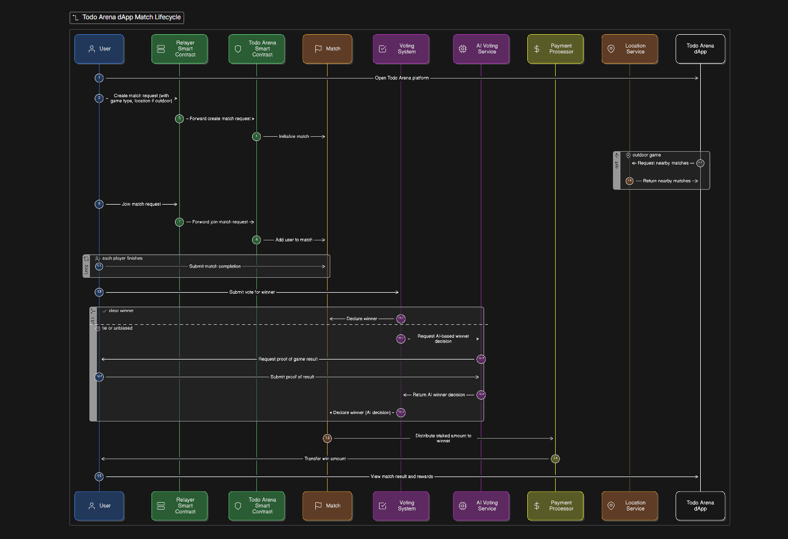

# todosArena

A decentralized sports/games management platform with AI-powered verification, community voting, and blockchain-secured token rewards.

## About the Project

### Inspiration
When I saw kids in this generation only playing video games, which often makes them lonely, I felt inspired to create **TodosArena**. My goal was to build a platform where they can play *any* type of game together—whether it's physical sports like basketball or digital e-sports—fostering connection and community. I wanted to use technology not to isolate, but to bring people together through shared competitive experiences.

### What it does
TodosArena is a decentralized platform that gamifies both physical and digital activities. It allows users to create matches, stake tokens, and compete in various games. Winners are verified using **Gemini AI**, which analyzes camera feeds or screenshots, and the community can vote to ensure fairness. It bridges the gap between real-world activities and on-chain rewards.

### How we built it
We built TodosArena using a modern **React** frontend with **TailwindCSS** for a sleek, responsive design. For the blockchain layer, we wrote **Solidity** smart contracts and deployed them across **multiple EVM chains** (Sepolia, Arbitrum, Base, etc.) using a custom **Relayer** architecture. This ensures users across different networks can participate seamlessly. We integrated **Google's Gemini AI** to act as an intelligent oracle, processing image data to determine match outcomes accurately.

### Challenges we ran into
Integrating real-world verification with blockchain was a significant challenge. We had to carefully tune the AI prompts to accurately detect winners from various image angles and lighting conditions. Additionally, handling **cross-chain state synchronization**—ensuring that a user staking on Arbitrum is correctly registered for a match on Sepolia—required designing a robust event-driven backend listener and Relayer system.

### Accomplishments that we're proud of
We are proud of successfully creating a verification system that can judge interactions in both the physical and digital worlds. Deploying our contracts to **over 10 testnets** and managing the architecture to support them all was a major technical feat. We also successfully implemented a **User Registration** system that rewards new players with tokens, lowering the barrier to entry.

### What we learned
We learned the immense potential of combining **AI Agents** with **Web3**. AI effectively solves the specific "Oracle Problem" of verifying unstructured real-world data (like a photo of a chessboard). We also gained deep insights into **account abstraction** concepts by building our Relayer system, which simplifies the crypto experience for end-users.

### What's next for TodosArena
We plan to expand the AI's capability to analyze **video feeds** in real-time for more complex sports. We also aim to integrate a **DAO** structure so the community can vote on platform parameters. Developing a native mobile app is also on the roadmap to make capturing "proof of win" even easier for outdoor sports.

## Features

- 🎮 **Multi-Game Support**: Supports online games, outdoor athletics, and indoor sports.
- 🤖 **AI Verification**: Uses  AI to detect winners via camera or screenshot proof.
- 🗳️ **Community Voting**: All players can vote on results to ensure transparency.
- 🪙 **Token Rewards**: Winners receive crypto on the blockchain as rewards.
- 📍 **Location-Based**: Find and join outdoor games near your location.
- ⛓️ **Blockchain Secured**: All data is stored on the Ethereum blockchain for transparency and security.
- 🌐 **Multi-Network Support**: Supports mostly all EVM networks (adding in progress)

## Architecture



### System Overview

TODOs Arena uses a **multi-layer architecture** designed for cross-chain compatibility, scalability, and decentralized verification:

#### 1. User Layer
Users can connect from **any supported EVM blockchain network** (Ethereum, Arbitrum, Polygon, Base, Optimism, etc.) using their Web3 wallets. This enables true multi-chain participation where players on different networks can compete against each other.

#### 2. Relayer Layer
Each supported blockchain has a deployed **Relayer Contract** that handles:
- **User Registration**: New users register and receive **100 TODO tokens** as a welcome bonus
- **Token Staking**: Users stake TODO tokens from their balance to join matches
- **Balance Management**: Tracks user TODO token balances, deposits, and withdrawals
- **Event Emission**: Emits events that the backend listener captures for cross-chain synchronization

#### 3. Backend Listener
A centralized backend service that:
- Listens to events from all Relayer contracts across different networks
- Processes stake confirmations and user registrations
- Relays verified actions to the primary TodosArena contract
- Ensures cross-chain state consistency

#### 4. Primary Chain (Sepolia)
The **TodosArena Contract** on Ethereum Sepolia serves as the source of truth and contains:
- **Match Management**: Create, join, start, and complete matches
- **Voting System**: Decentralized consensus-based winner determination
- **AI Verification**: Integration with Gemini AI for automated result verification
- **Reward Distribution**: Automatic TODO token distribution to winners
- **TODO Token (ERC20)**: Native platform token with 1 billion supply

#### 5. AI Layer
**Gemini AI** provides intelligent winner detection through:
- **Camera Capture**: Real-time analysis of physical game results
- **Screenshot Analysis**: Verification of online game results
- **Fallback Mechanism**: AI steps in when voting doesn't reach consensus

### Data Flow

1. **Join Match**: User → Relayer (stake tokens) → Backend → TodosArena (register participant)
2. **Submit Vote**: User → TodosArena (via backend) → Voting tally
3. **AI Verification**: User uploads proof → Gemini AI → Winner determination
4. **Reward Distribution**: TodosArena → Winner accounts credited with TODO tokens


## Quick Start

### Prerequisites
- Node.js (v16 or higher)
- npm or yarn
- MetaMask or any Web3 wallet
- Access to the Gemini AI API

### Installation

```bash
# Install dependencies
npm install

# Copy environment file and configure
cp .env.example .env

# Run development server
npm run dev
```

### Smart Contracts

The platform uses two main smart contracts:

#### Relayer Contract
- **Purpose**: Deployed on multiple blockchain networks (testnets and mainnets)
- **Features**:
  - User message signing and storage
  - Stake recording for cross-chain participation
  - Admin verification of stakes
  - Message execution tracking
- **Networks**: Currently deployed on Sepolia, Arbitrum Sepolia, Linea Sepolia, Polygon Amoy, Base Sepolia, Blast Sepolia, Optimism Sepolia, ZKSync Sepolia, BSC Testnet, Scroll Sepolia, and OPBNB Testnet

#### TodosArena Contract
- **Purpose**: Main contract deployed on primary network (Ethereum Sepolia for testing)
- **Features**:
  - **ERC20 Token**: "TODO Arena Token" (TODO) with 1 billion total supply
  - **Match Management**: Create and manage matches with entry stakes, participant limits, and voting durations
  - **Cross-Chain Integration**: Receives actions from Relayer contracts across different networks
  - **AI Verification**: Stores AI-generated reports for match results
  - **Community Voting**: Participants vote on winners with consensus-based finalization
  - **Reward Distribution**: Automatic token minting and distribution to winners
  - **Stake Verification**: Cross-chain stake confirmation system
- **Roles**: Admin, Oracle, Distributor, Voting Manager, Minter, Burner, Bridge

#### Deployment Commands

```bash
# Compile smart contracts
npx hardhat compile

# Deploy to local network
npx hardhat node
npx hardhat run scripts/deploy.cjs --network localhost

# Deploy to Sepolia testnet
npx hardhat run scripts/deploy.cjs --network sepolia

# Deploy to Arbitrum Sepolia
npx hardhat run scripts/deploy.cjs --network arbitrumSepolia

# Deploy to all test networks (skips failed deployments)
./deploy-testnets.sh
```

## Environment Setup

Copy `.env.example` to `.env` and fill in the following variables:

- `PRIVATE_KEY`: Your wallet private key for deployment.
- `VITE_WALLETCONNECT_PROJECT_ID`: Obtain this from WalletConnect Cloud.
- `GEMINI_API_KEY`: Required for AI detection features.

## Tech Stack

- **Frontend**: React, Vite, TailwindCSS, Framer Motion
- **Web3**: wagmi, RainbowKit, ethers.js
- **Smart Contracts**: Solidity, Hardhat, OpenZeppelin
- **AI**: Gemini AI API

## Project Structure

```
├── contracts/          # Solidity smart contracts
├── scripts/            # Deployment scripts
├── src/
│   ├── components/     # React components
│   ├── pages/          # Route pages
│   ├── hooks/          # Custom hooks
│   └── config/         # Configuration
└── public/             # Static assets
```

## Usage

1. **Create a Match**: Navigate to the "Create Match" page and fill in the details.
2. **Join a Match**: Browse available matches and join one.
3. **Submit Proof**: Upload a screenshot or use the camera to submit proof of your win.
4. **Vote**: Participate in community voting to verify results.
5. **Claim Rewards**: Winners can claim Crypto.


